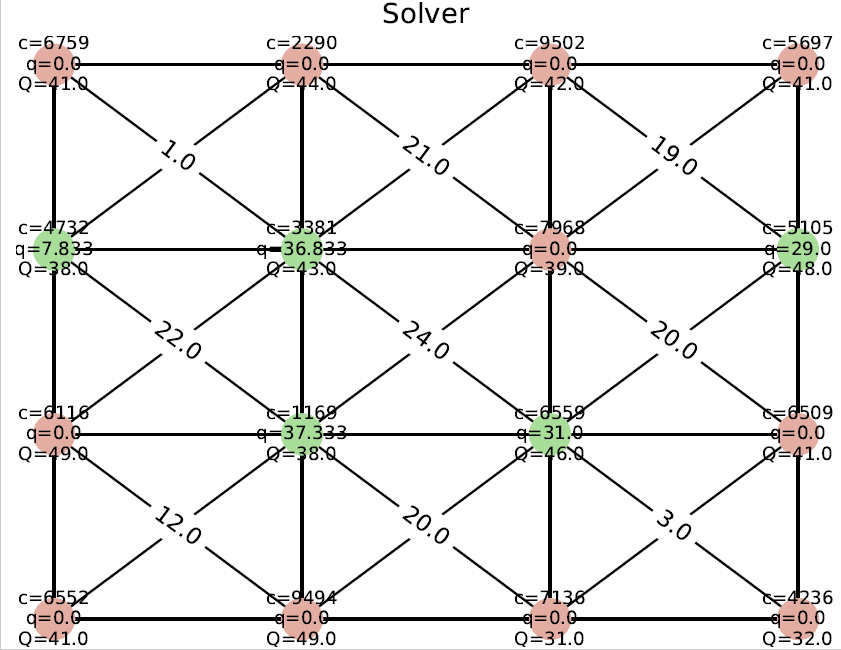

# Antenna Location Problem

Let us consider a set of squared cells, each one characterized by a different demand R<sub>mn</sub>. We can
install the antennas in the vertexes of each cell. Hence, the possible locations are the ones shown
below. Each antenna absorbs demand by all the four cells that share the vertex in which the
antenna is located.


If more antennas cover a cell (as below) R<sub>mn</sub> is equally divided among all the antennas.

Each antenna has a maximum capacity that must not be exceeded q<sub>ij</sub> and an installation cost c<sub>ij</sub>.
The objective is to minimize the total cost while covering all the demand.

## Scripts
### /etc/config.json(Config file)
Every instance generation needs configuration settings. The configured parameters will define the nature of the input instance.

| Variable | Description |
| ------------- | ------------------------- |
| antenna_row|     Number of rows of the grid |
| antenna_column|   Number of columns of the grid  |
| max_capacity|     Maximum capacity for each antenna |
| min_capacity|   Minimum capacity for each antenna|
| max_demand|    Maximum traffic demand for each cell|
| min_demand|    Minimum traffic demand for each cell |
| max_cost|      Maximum installation cost for each antenna |
| min_cost|     Minimum installation cost for each antenna |
 
```json
{
	"antenna_row":4, 
	"antenna_column":4,
	"max_capacity":40,
	"min_capacity":20,
	"max_demand":25,
	"min_demand":15,
	"max_cost":10000,
	"min_cost":8000,
	"distribution": "uniform"
}
```
There are three input instances:R<sub>mn</sub>,c<sub>ij</sub>, and q<sub>ij</sub>.  The generation of these inputs is based on the specific test that will be performed to the exact and heuristic solutions.  Moreover, each entry sample can be generated using different distributions.
For executing each script, the **config file must be modified** according with the defined input instance or each test.

### /graph/graph.py

With the objective of visualizing the given solution for every instance and test, a script that generates a graph was created. One of the generated images is ilustrated below. The green dots symbolize that the antenna was installed, while the red represent the non-installation of them. 

In every vertex, it is indicated the installation cost (c), the portion of capacity given (q), and the total capacity (Q) of each antenna. The demand required by each cell is depicted in the center of every four adjacent antennas.


### /heuristic/simpleHeu.py
F
### /simulator/instance.py
JG
### main.py
This script will execute the solver and the heuristic methods for only one instance, 
### mainIter.py
L
### mainIterDistro.py
F
### mainIterHeuristic.py
L
### mainIterRatio.py
F
### mainSolverStd.py


In this script, the seeds of the grid are varied. For each seed, the solver is executed a define number of iterations that is set in iternumber. Finally, the solution is stored in a csv file.

```bash
    seeds_number = 30  # Number of seeds
    iterNumber = 100
```


### graphResults.py
JG


```bash
python -m parlai.scripts.eval_model -m ir_baseline -t personachat -dt valid
```

