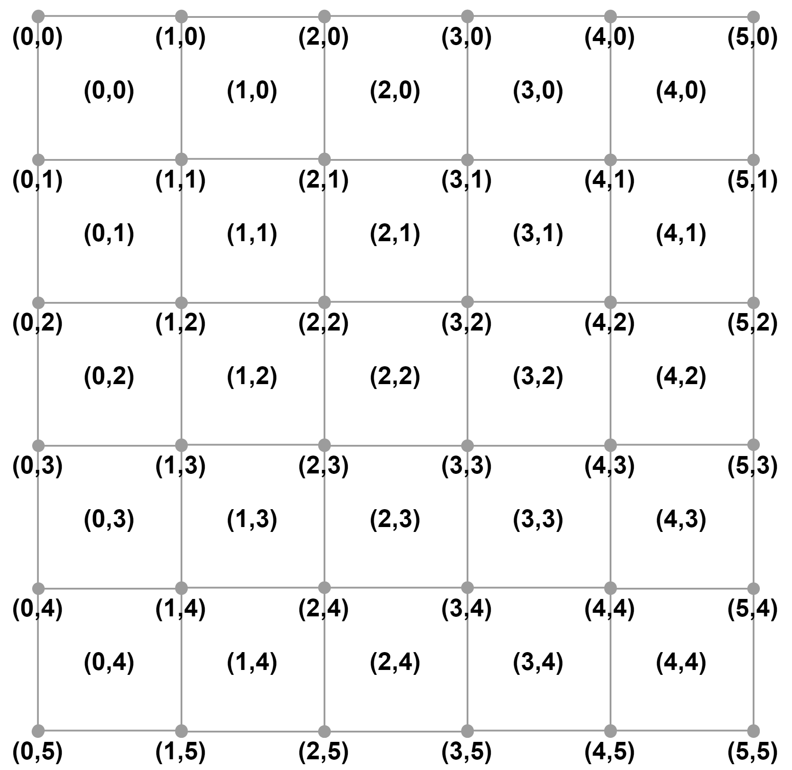

# Antenna Location Problem

Let us consider a set of squared cells, each one characterized by a different demand R<sub>mn</sub>. We can
install the antennas in the vertexes of each cell. Hence, the possible locations are the ones shown
below. Each antenna absorbs demand by all the four cells that share the vertex in which the
antenna is located.



If more antennas cover a cell (as below) R<sub>mn</sub> is equally divided among all the antennas.

Each antenna has a maximum capacity that must not be exceeded Q<sub>ij</sub> and an installation cost c<sub>ij</sub>.
The objective is to minimize the total cost while covering all the demand.

## Scripts
### /etc/config.json(Config file)
Every instance generation needs configuration settings. The configured parameters will define the nature of the input instance.

| Variable | Description |
| ------------- | ------------------------- |
| antenna_row|     Number of rows of the grid |
| antenna_column|   Number of columns of the grid  |
| max_capacity|     Maximum capacity for each antenna |
| min_capacity|   Minimum capacity for each antenna|
| max_demand|    Maximum traffic demand for each cell|
| min_demand|    Minimum traffic demand for each cell |
| max_cost|      Maximum installation cost for each antenna |
| min_cost|     Minimum installation cost for each antenna |
 
```json
{
	"antenna_row":4, 
	"antenna_column":4,
	"max_capacity":40,
	"min_capacity":20,
	"max_demand":25,
	"min_demand":15,
	"max_cost":10000,
	"min_cost":8000,
	"distribution": "uniform"
}
```
There are three input instances:R<sub>mn</sub>,c<sub>ij</sub>, and q<sub>ij</sub>.  The generation of these inputs is based on the specific test that will be performed to the exact and heuristic solutions.  Moreover, each entry sample can be generated using different distributions.
For executing each script, the **config file must be modified** according with the defined input instance or each test.
### /graph/graph.py
JS
### /heuristic/simpleHeu.py
F
### /simulator/instance.py
JG
### main.py
This script executes the solver and the heuristic methods for only one instance. The solver's maximum execution time in seconds, the number of iterations of the heuristic algorithms and the output file path to collect the results are set at the beggining of the script as folows:
```bash
    time_limit = 60*60  # maximum execution time in seconds
    iter_number = 1000  # Max number of iteration for each heuristic algorithm
    output_file = "./results/exp_general_table.csv"  # output file
```
After the execution of this script it is possible to see in console the total cost and the consumed time for each method. Moreover, the graphs with the instance and the solution of each method are generated and stored in results/Figures/Instances.
### mainIter.py
In this script, the seeds and dimensions of the grid are varied. In addition to the execution time and number of iterations, the parameters to be set are the maximun and minimum number of columns and rows, and the number of seeds. 
```bash
   seeds_number = 10  # Number of seeds
    row_min = 3  # Minimum number of rows
    row_max = 10  # Maximum number of rows
    column_min = 3  # Minimum number of columns
    column_max = 10  # Maximum number of columns
```
The solutions are generated with the solver and all the heuristic methods for all dimensions (within the established limits) for each seed, and stored in a csv file.
### mainIterDistro.py
F
### mainIterHeuristic.py
In this code, a variation of the number of iterations of the heuristic algorithms is made for different values of the seed. The values of the number of iteration are defined as:
```bash
iterations = [5, 10, 50, 100, 500, 1000, 5000, 10000, 50000, 100000, 500000, 1000000]
```
For each seed, the the heuristic methods are executed with each of the values of the iterations vector.
### mainIterRatio.py
F
### mainSolverStd.py
JS
### graphResults.py
JG


```bash
python -m parlai.scripts.eval_model -m ir_baseline -t personachat -dt valid
```

