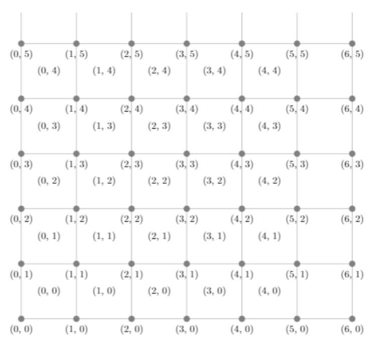

# Antenna location 
## Operational research: theory and applications

Let us consider a set of squared cells, each one characterized by a different demand 𝑅𝑖𝑗. We can
install the antennas in the vertexes of each cell. Hence, the possible locations are the ones shown
below. Each antenna absorbs demand by all the four cells that share the vertex in which the
antenna is located.

If more antennas cover a cell (as below) 𝑅𝑖𝑗 is equally divided among all the antennas.

Each antenna has a maximum capacity that must not be exceeded 𝑞𝑖𝑗 and an installation cost 𝑐𝑖𝑗.
The objective is to minimize the total cost while covering all the demand.